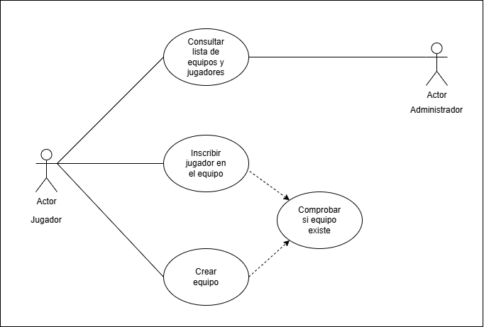
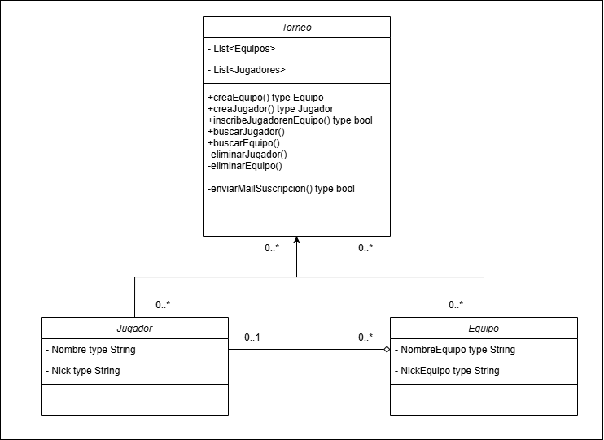

# torneo-esports-uml

# Sistema de Gestión de Torneos de eSports
## Autor
Nombre : Manuel Alejandro López Ortega
Perfil GitHub : ManuelAlejandroLopezOrtega
## Descripción del Proyecto
https://github.com/ManuelAlejandroLopezOrtega/torneo-esports-uml
Este proyecto implementa un sistema de gestión de torneos de eSports
utilizando UML para el modelado y Java para la implementación.
## Diagramas UML
### Diagrama de Casos de Uso

### Diagrama de Clases

## Estructura del Proyecto
torneo-esports-uml/ 
├── diagrams/
│ ├── casos-uso.png
│ ├── clases.png
├── README.md
Asignatura Datos del alumno Fecha
Nombre de la asignatura
ENTORNOS DE
DESARROLLO
Apellidos:López Ortega
Nombre: Manuel Alejandro
Actividades 10
© Universidad Internacional de La Rioja (UNIR)
├── LICENSE (opcional)
## Instalación y Ejecución
1. Clonar el repositorio:
`git clone https://github.com/ManuelAlejandroLopezOrtega/torneo-esports-uml.git`
2. Compilar y ejecutar el proyecto:
`cd src javac es/empresa/torneo/Main.java java es.empresa.torneo.Main`
## Justificación del diseño
En nuestro diagrama de casos hemos optado por poner dos actores, Jugadores y Administradores, ambos tienen acceso a la lista de jugadores y equipos inscritos al torneo pero en nuestro caso solo los jugadores pueden crear equipos, siempre y cuando no exista otro equipo igual, e inscribirse como jugadores a un equipo si el equipo existe.

En el diagrama de clases tenemos 3 clases la clase jugador, que crea un jugador a partir de un nombre y un nick, la clase equipo, crea un equipo con un nombre y un nick, y la clase Torneo en la que tenemos una lista con jugadores y equipos desde la que creamos los metodos para que los usuarios de la pagina puedan acceder a la creacion de perfiles de jugadores y equipos y gestionar a que torneo se unen su equipo o a que equipo se van a unir como jugador, asi como un buscador para buscar a los jugadores o equipos deseados por nick o nombre. Las clases jugador presenta una relacion de dependencia debil con la clase equipo en la cual un jugador puede estar en un equipo y un equipo puede contener de 0 a muchos jugadores y estas dos a su vez estan relacionadas con la clase torneo en la que puede haber de cero a muchos jugadores o equipos en un torneo.

Por qué se eligió esa estructura y cómo se organizan las clases.
## Conclusiones
Se ha aprendido ha desarrollar diagramas de casos y de clases de forma efectiva.
